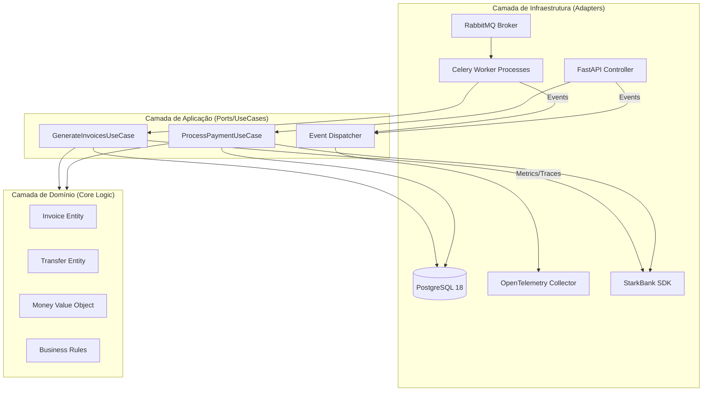
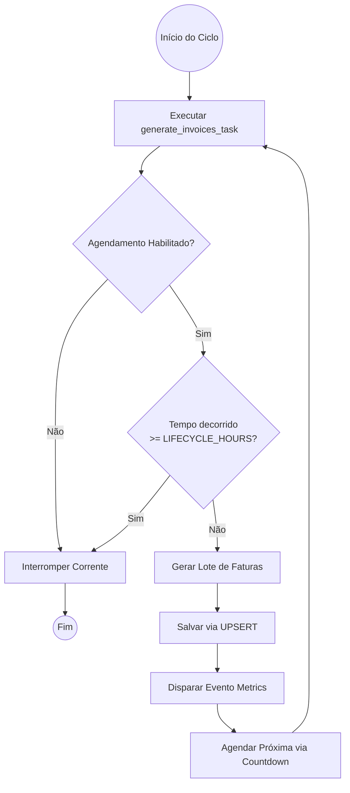
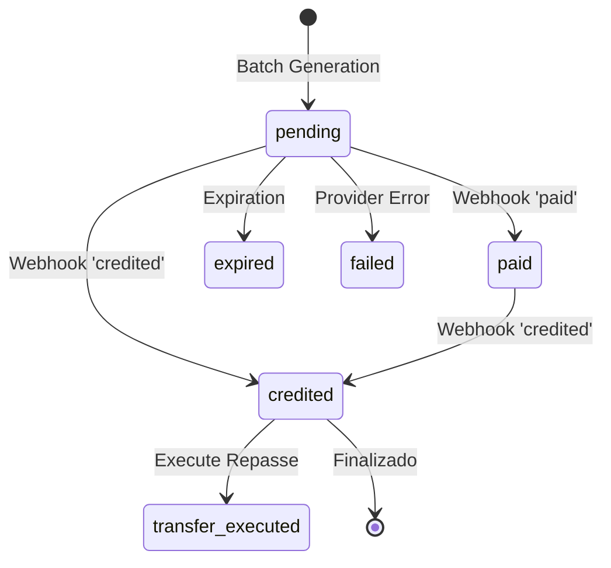
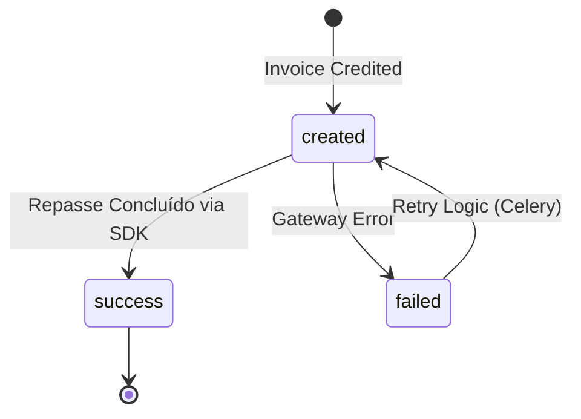

# 🏗️ Arquitetura Detalhada e Ciclo de Vida

Este documento descreve o funcionamento interno do **Payment Orchestrator**, detalhando as camadas, a máquina de estados e o ciclo de automação.

---

## 1. Diagrama de Arquitetura (Hexagonal)

O sistema segue os princípios de *Clean Architecture*, isolando a inteligência de negócio das ferramentas de infraestrutura.

---

## 2. Ciclo de Vida do Worker (Automação 24h)

O agendador utiliza uma técnica de *Self-Chaining* via RabbitMQ. O ciclo tem um tempo de vida finito para garantir a economia de recursos em ambiente Sandbox.

---

## 3. Máquina de Estados (Financeiro)

O fluxo de vida das entidades é garantido por uma máquina de estados rígida, validada por webhooks e assinaturas digitais.

### Fluxo da Fatura (Invoice)
As transições são protegidas no domínio e persistidas de forma idempotente.

### Fluxo da Transferência (Transfer)

---

## 4. Garantias de Integridade Financeira

1.  **Money Value Object**: Todos os valores monetários são encapsulados no objeto `Money`, garantindo precisão em centavos e impedindo valores negativos ou operações inválidas.
2.  **Double-Layer Idempotency**:
    - **Infra**: O `WebhookEventRepository` registra cada `event_id` único no PostgreSQL usando `ON CONFLICT DO NOTHING`.
    - **Domínio**: A entidade `Invoice` valida a transição de estado. Se um evento tenta mover para um estado já atingido ou inválido, o processo é ignorado ou corrigido.
3.  **Pessimistic Locking**: O processamento de pagamentos utiliza `SELECT FOR UPDATE` para bloquear a linha da fatura no banco, evitando condições de corrida entre múltiplos workers Celery.
4.  **Resiliência via UPSERT**: O `PaymentRepository` utiliza a estratégia de UPSERT (`ON CONFLICT DO UPDATE`) para todas as persistências de entidades, garantindo que retentativas de jobs não criem duplicatas indesejadas.
5.  **Observabilidade de Negócio**: Métricas personalizadas como `payment.scheduler.status` e `payment.invoices.next_run_timestamp` permitem monitoramento em tempo real do status da automação no Grafana.

---

### Fluxo de Execução E2E

1.  **Geração**: O Worker gera faturas aleatórias (nomes/CPFs via Faker) e as envia para o StarkBank.
2.  **Webhooks**: A API recebe eventos `paid` e `credited`.
3.  **Orquestração**: 
    - Evento `paid`: Atualiza status para `PAID`.
    - Evento `credited`: Atualiza status para `CREDITED` e dispara `execute_transfer` (Repasse do valor líquido).
4.  **Telemetria**: Rastreamento completo de cada webhook, desde a recepção na API até a conclusão do repasse no Worker.
